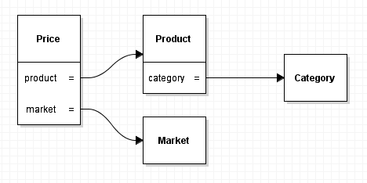

# Постановка задачи:
Реализовать сервис для сохранения категоризированного списка продуктов.

## Функциональные требования:
 1. Возможные операции и ограничения с категориями:
     1. Добавление
         1. Нельзя добавить категорию которая существует
         1. Название должно содержать только латинскийе буквы или кирилицу
     1. Удаление
         1. Нельзя удалить категорию если есть хотя бы один продукт в ней
 1. Возможные операции и ограничения с продуктами:
     1. Добавление
         1. Нельзя добавить продукт без штрихкода.
         1. Нельзя добавить продукт без названия.
         1. При добавлении выполнять поиск по штрихкоду на https://barcodes.olegon.ru для автозаполнения полей.
     1. Удаление
     1. Редактирование
         1. Нельзя редактировать штрихкод, категорию и идентификатор
 1. Возможные операции и ограничения с магазинами
    1. Добавление
    1. Удаление
 1. Обеспечить возможность сохранения истории цен на продукт
     1. При удалении продукта удаляется и история цен
     1. При удалении магазина удаляется и история цен
     1. Цена сохраняется с привязкой к магазину
 1. Обеспечить возможность просмотра списков 
     1. по штрихкоду - список цен на товар в магазинах
     1. по магазину - список продуктов
     1. по списку штрихкодов - магазины с общей ценой и количеством позиций которых нет
        1. для продуктов которых нет в магазине цена равна нулю
        1. результат отсортирован по цене и количеству отсутствующих позицый
  
## Сущности:
Диаграмма объектов:

# Архитектура

## Структура проекта
Для организации и сборки програмных модулей использован <b>Maven</b>.
 
## Структура приложения
Используется паттерн MVC. Не используется Spring.  
 
## Безопасность
Доступен всем. 
 
## База данных
Для хранения и доступа к данным использована <b>HSQLDB</b>.

## Использовались
* [Maven](https://maven.apache.org/)
* [gson](https://github.com/google/gson)

## Автор
* **Николаев А.С.**